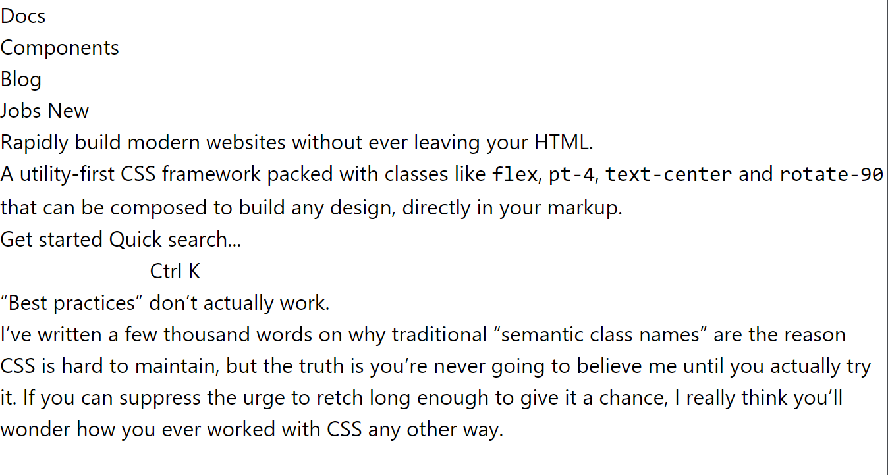

# Infi Coding Dojo: TailwindCSS

This quick workshop will provide you with a great path to learn some (more) TailwindCSS.
You follow it beginning-to-end, asking for help from more experienced folks along the way.
Or you can branch off and pick your own path for learning.
Up to you!

The workshop should be roughly two hours to complete.

## Introduction

We presume you know _some_:

- HTML
- CSS
- Any code editor, e.g. VSCode

A little git helps, but you can also just find the "Download ZIP" button.

### Getting started

We have prepared a quick start set up for you in this repository.
Follow these steps:

#### 1. Clone this repository

`git clone git@github.com:infi-nl/coding-dojo-tailwindcss.git` or download the ZIP.

#### 2. Install dependencies

`npm install`

#### 3. Start the development server

`npm run dev`

After these steps your browser should automatically open a new tab that shows the an unstyled website (see image below). This is the website we will style using TailwindCSS.

If your browser does not open automatically, you can open the website yourself by going to [http://localhost:8181](http://localhost:8181).

Now you're good to go. The file we will be working in is `src/index.html`.


_- Website before styled with TailwindCSS_

### Objective

The goal for this workshop is to recreate a website.
The TailwindCSS home page, to be exact.
We'll provide you with the plain HTML, you need to add the required bits of Tailwind to match the end goal.

Here's what we're aiming for:


It's only the first part of the Tailwind home page, as that's plenty for a two-hour workshop.
But if you really want, you can check [the full size screenshot](./assets/images/tailwind-dojo-example-dark-mode-full-size.png) and build the whole thing.

### Cheating

Sure, you could look at the TailwindCSS home page, use the inspector, and see how _they_ did it.
But remember: most learning is done while _doing_.

Try to first solve things yourself.
Consider checking only at the end how they did things!

## Workshop

Let's get started!
**We recommend scanning ahead** through the entire dojo to ensure you don't pick up too much too early.

---

### Objective 0: What _is_ TailwindCSS?

In a nutshell, you style your application while writing HTML and application components, by using "utility" `class`es.
For example, `m-1` or `m-2` (etc) sets a margin around an element.
Or `bg-gray` sets a gray background.

This entire workshop can and should be completed using [the TailwindCSS docs](https://tailwindcss.com/docs/) (and optionally a search engine).
We recommend having it open at all time, using its `CTRL`+`K` quick search heavily.

This workshop explicitly skips _all_ core concepts or bigger ideas behind Tailwind.
**We dive straight in**, by design!

If this unnerves you, _or_ if you have absolutely zero knowledge of CSS and web applications:
you can read up about the [Core Concepts](https://tailwindcss.com/docs/utility-first), the [Installation and Setup](https://tailwindcss.com/docs/installation), or the [TailwindCSS home page](https://tailwindcss.com/) (which explains _why_ you'd use it).

That's it!
On to the real work.

---

### Objective 1: Basics

First we'll learn about the basics.

- Layout, spacing, sizing;
- Typography;
- Borders, backgrounds

> **💡 TIP:**
>
> Don't focus too much on fancy gradient backgrounds or the _perfect_ colors just yet.
> You're trying to learn _how to use Tailwind_, not to get a perfect website.
>
> In addition, go for a "low fidelity" (or: "boring") squared off layout with lots of stubs.
> In part 2 you'll do more fancy stuff (peek ahead at the workshop!).
>
> Aim for "Good Enough"!

Using only `class` attributes try to get close to the image below.
We include some guidelines shown to help visualize.
For the gray boxes we recommend starting with placeholders.


Some tips:

- Read up early on how [`margin`](https://tailwindcss.com/docs/margin) and [`padding`](https://tailwindcss.com/docs/padding) work;
- Read up early how [`background` color works](https://tailwindcss.com/docs/background-color) and extrapolate to other things that use color (text, border, etc.)
- Start the _background_ as a dark blue instead of a fancy background with texture;
- Use _flexbox_ to layout the menu bar;

Bonus objective:

If you're going really fast, consider taking on these bonus objectives:

- Make the design _responsive_ to viewport size;
- Make the design respond to the system _theme_ (dark/light);

---

### Objective 2: The extras

This whole section is _self-paced_.
Also, feel free to _skip_ any sections that take too long (and revisit them later!):
none of them are blocking.

#### 2a. Prettify boxes

Time to make our various boxes prettier, using:

- a border and border radius
- a subtle shadow
- giving the page a top-to-bottom gradient with multiple stops

The goal here is to learn Tailwind, not to make it _pretty_ per se.
Don't loose a ton of time on tweaking the details.

#### 2b. Hover effects

Using the `hover:` modifier, classes can be applied only on hovering.
Try to use this to:

- Change backgrounds on buttons when hovering;
- Change text colors on links when hovering;
- Change opacity of certain elements when hovering;

Bonus objective:

- Use [`transition`](https://tailwindcss.com/docs/transition-property) to ease into the hover effects

#### 2c. Animation

Don't spend too much time here.
Just get familiar with it.
Try to make the buttons ["pulse"](https://tailwindcss.com/docs/animation#pulse) when hovered.
And scan quickly through the other animation docs.
Then move on.

#### 2d. Transforms

Go quickly through this section too.
Try to add one of the ["rotate"](https://tailwindcss.com/docs/rotate) transforms on buttons.
Scan through the other related "Transforms" menu items.
Just to internalize what is available.
Then move on.

#### 2e. Filters

When used sparingly, filters can help your users understand your application better.
For example if you really need them to focus on one element (e.g. a modal dialog), you could blur the entire background.

Try to achieve the following:

- make the `body` have a `blur` effect by default;
- upon `hover:` remove or reset the blur;

Bonus objective:

- inject a small "modal" `<div>` in your document;
- make that "modal" vertically and horizontally centered on the page;
- use `z-index` to ensure the modal is on top;
- use a full screen overlay div with half opacity, between the "modal" and the `body`;
- `blur` the entire body, _except_ this "modal" div;

#### 2f. Accessibility

With Tailwind all your standard CSS accessibility knowledge still holds.
Only a handful of things change, mostly with some utility methods.
We recommend [just reading up carefully on this one](https://tailwindcss.com/docs/screen-readers) during the dojo.

---

### Objective 3: Customizing Tailwind

Let's go a bit more advanced, and customize our setup.
Going from easiest to hardest.

#### Use a CDN

If you just want to toy around with TailwindCSS, there's at least two good options:

- Use the [play.tailwindcss.com](https://play.tailwindcss.com/) playground;
- Use the [CDN](https://tailwindcss.com/docs/installation/play-cdn);

This is not recommended for production, but great for demo's and similar purposes.
Let's try it now:

1. Go to [codepen.io](https://codepen.io/pen/) (or a similar fiddle tool);
1. Dump the following in there:

   ```html
   <script src="https://cdn.tailwindcss.com"></script>
   <div class="p-4 m-8 bg-slate-200 motion-safe:animate-bounce inline-block">
     <span class="m-4 motion-safe:animate-spin inline-block">🍕🥤😋</span>
   </div>
   ```

1. Confirm it's working;
1. Toy around a short bit longer;

Bonus objective, which you might've already stumbled upon:

- Use some [arbitrary values](https://tailwindcss.com/docs/adding-custom-styles#using-arbitrary-values);

#### Custom utility classes

Be sure to **read up on [Tailwind's philosophy around reusing styles](https://tailwindcss.com/docs/reusing-styles)** (probably _after_ the dojo), but sometimes you want to have your own utility.
A prime example is a `btn` and a `btn-primary` class.

Using either your codepen with Tailwind's CDN, or using this repository's setup, try to add custom utility classes.
Follow [the `@apply` documentation](https://tailwindcss.com/docs/reusing-styles#extracting-classes-with-apply) to do so.

#### Theme customization

Try to customize your theme by using a config either (`module.exports` for this repository's code, or `tailwind.config` global when using the CDN)

- try to
- [extend](https://tailwindcss.com/docs/theme#extending-the-default-theme) the `colors` with `'hothothot': '#cf44cf'` and use it for your body text;
- [override](https://tailwindcss.com/docs/theme#overriding-the-default-theme) the `fontFamily` to always enforce `Comic Sans`;

That's it!
You're now a Tailwind-master!

If you're new to Tailwind, and especially if you know "proper" CSS advice of old, you might think:

> Doesn't this go against all previous advice on CSS?

If you feel that sentiment, or feel like Tailwind is "just a lot of messy fuss", then we recommend you do one of these:

- Talk to your local TailwindCSS afficionado;
- Give it a (proper!) try for some time;
- Let it go. Let it goooo!

Whatever you do: enjoy!

---

### Objective: Bonus Material

Still can't get enough?
Here are various other great resources and ideas:

- Use browser dev tools to inspect the Tailwind sites themselves, and learn from the masters themselves;
- Check out the [HeadlessUI](https://headlessui.com/) and [TailwindUI](https://tailwindui.com/) resources;
- Check out how another big CSS framework (Bootstrap) [has embraced utility functions](https://getbootstrap.com/docs/5.0/utilities/api/) too;
- Watch some [TailwindLabs video tutorials](https://www.youtube.com/tailwindlabs);
- Dive deeper into [`flex` layout](https://tailwindcss.com/docs/flex) and [`grid` layouts](https://tailwindcss.com/docs/grid-template-columns), they're the future of layouting;
- Go top-to-bottom through the documentation outline, at the least to scan what's all in there (spoiler: 98% of all CSS you'll ever need);

---

## In closing

Thanks for going through this dojo.
We hope you enjoyed it as much as we enjoyed creating it.

This dojo was originally created using time made available by [infi.nl](https://infi.nl/).
